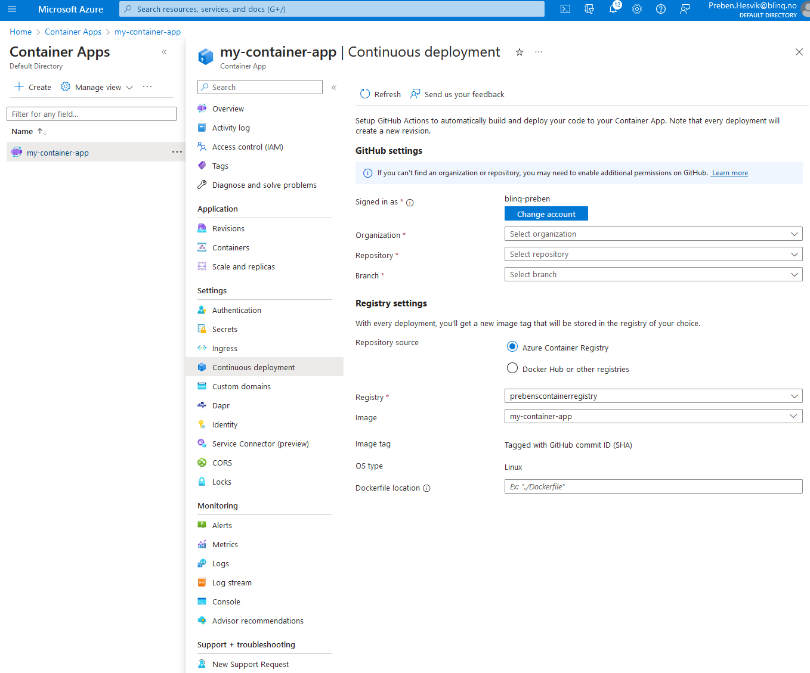
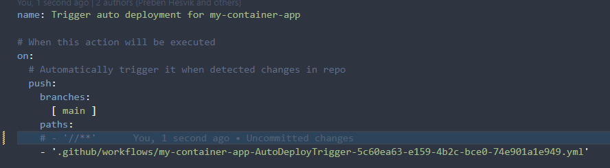

# Hello World Flask App Container Via ACR and GitHub Actions

[A Cloud Guru YouTube video with all the necessary stems](https://www.youtube.com/watch?v=P1MzptEDmyc)

##### 1. Create a container registry
```bash
az acr create --resource-group <resource-group-name> --name <registry-name> --sku <sku>
```
##### 2. Go to the container registry in Azure portal and  click on `Access keys` and set`Admin user` as `enabled`

##### Optional. Retrieve the login server and admin username for authentication. 
```bash
az acr show --name <registry-name> --query loginServer --output table
```

##### 3. Log into the ACR
```bash
az acr login --name <registry-name>
```

##### 4. Build docker image through the Azure CLI
```bash
az acr build --image <image-name>:<tag> --registry <acr-name> --platform <linux | windows> https://github.<repository-name>.git
```

##### Optional: Run the image to see that it works as intended
```bash
az acr run --registry <container-registry-name> --cmd '$Registry/<docker-image>:<tag>' /dev/null
```

##### 5. Create an app container environment in which the container app will belong to
```bash
az containerapp env create \
  --name <environment-name> \
  --resource-group <resource-group> \
  --location <location>
```

##### 6. Create an Azure container app either through the user interface or the CLI
```bash

az containerapp up \
  --name <container-app name> \
  --resource-group <resource-group> \
  --environment <container-app-environment> \ 
  --location <location> \
  --image <container-registry>.azurecr.io/<container-app>:<tag> \
  --target-port 80 \
  --ingress external \
  --query properties.configuration.ingress.fqdn

```
##### 7. Create a Service Principal to allow GitHub actions to create/update the container app
```bash
az ad sp create-for-rbac --name <service-principal-name> --role contributor \
--scopes /subscriptions/<subscription_id>/resourceGroups/<resource-group> \
--sdk-auth
```
##### 7. Go to Azure portal => your newly created container app => continuous deployment and fill out the GitHub and registry settings and click on `Start continuous deployment`. (see image below)
Azure will now create a .github folder which will contain the workflow yml files inside your GitHub repository. 



##### 8. Pull code from the remote branch to your local branch

##### 9 Comment out code `- '//**'` under path in the workflows yaml file


##### 10. Commit and push any changes.